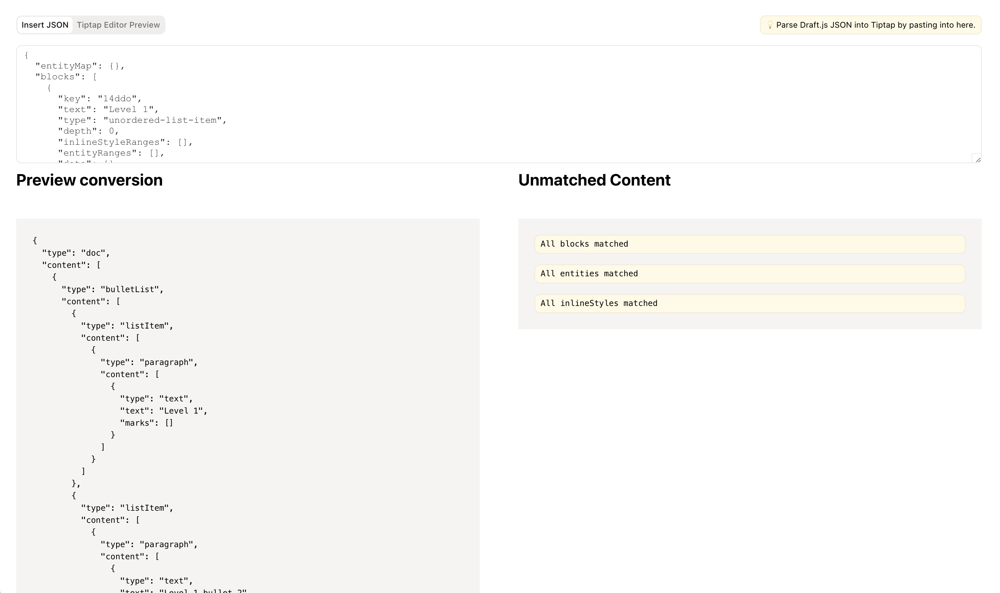
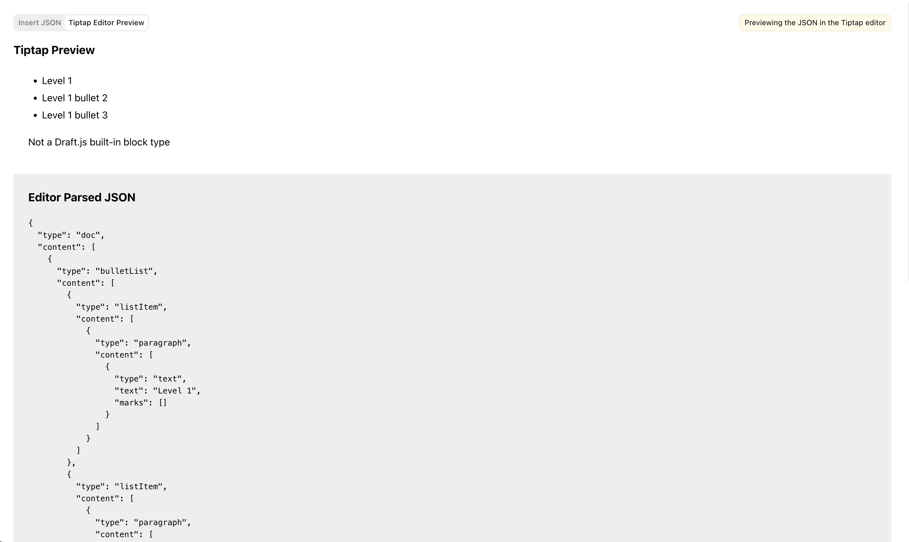

# draftjs-to-tiptap

Convert Draft.js content to Tiptap-compatible content.

The best place to try this library is in the [CodeSandbox](https://codesandbox.io/p/sandbox/draftjs-to-tiptap-6d44d3?file=%2Fsrc%2FconvertFromJSON.ts%3A3%2C34).

## Why?

Draft.js and Tiptap are both rich text editors, but they have different data structures. Draft.js preferring a flat structure of blocks with inline styles and entities, while Tiptap uses a nested structure of nodes and marks.

Draft.js has been archived, and Tiptap is a popular alternative for building rich text editors in multiple frameworks. This library aims to make it easier to migrate from Draft.js to Tiptap by providing a conversion tool.

## Installation

```bash
npm install @tiptap/draftjs-to-tiptap

yarn add @tiptap/draftjs-to-tiptap

pnpm add @tiptap/draftjs-to-tiptap

bun add @tiptap/draftjs-to-tiptap
```

## Getting Started

Unfortunately, there is no one-size-fits-all solution for converting Draft.js content to Tiptap content. The conversion process depends on the specific use case and the customizations made to the Draft.js content. Draft.js did not come with very many built-in features, so many developers added their own customizations to the content structure. So, the conversion process will likely need to be customized to fit your specific use case.

The conversion process involves mapping:

- Draft.js blocks to Tiptap nodes
- Draft.js entities to Tiptap nodes
- Draft.js inline styles to Tiptap marks
- Draft.js entities to Tiptap marks

### What are blocks, entities, inline styles, nodes, and marks?

- **Blocks** are the main structural units of content in Draft.js. They are the paragraphs, headings, lists, etc.
- **Entities** are the annotations on the content, like links, mentions, etc.
- **Inline styles** are the formatting applied to the text, like bold, italic, etc.

Here is an example of all the types of content Draft.js supports in a ContentState:
  
  ```json
  {
    "blocks": [
      {
        "key": "1",
        "text": "Hello, world!", // block text
        "type": "unstyled", // block type
        "depth": 0,
        "inlineStyleRanges": [],
        "entityRanges": [ // entities applied to the block text
          {
            "offset": 0, // start index of the entity
            "length": 12, // length of the entity
            "key": 0 // entity key in the entityMap below
          }
        ],
        "data": {}
      }
    ],
    "entityMap": {
      "0": { // entity key
        "type": "LINK", // entity type
        "mutability": "MUTABLE",
        "data": { // entity data
          "url": "https://example.com"
        }
      }
    }
  }
```

In Tiptap:

- **Nodes** are the main structural units of content in Tiptap. They are the paragraphs, headings, lists, etc.
- **Marks** are the formatting applied to the text, like bold, italic, etc.

Here is an example of all the types of content Tiptap supports in a ContentNode:

```json
{
  "type": "paragraph", // node type
  "content": [ // node content
    {
      "type": "text", // node type
      "text": "Hello, world!",
      "marks": [ // marks applied to the text
        {
          "type": "link", // mark type
          "attrs": { // mark attributes
            "href": "https://example.com"
          }
        }
      ]
    }
  ]
}
```

As you can see, the structure of the content is quite different between Draft.js and Tiptap. This library aims to make it easier to convert Draft.js content to Tiptap content.

## Usage

If you are using the default Draft.js content structure, you can use the default converter provided by this library. If you have a custom Draft.js content structure, you will need to add custom mappings to the converter.

Using the default converter is simple. Here is an example of how to convert Draft.js content to Tiptap content:

```typescript
import { DraftConverter } from '@tiptap/draftjs-to-tiptap';

const draftContent = {
  blocks: [
    {
      key: '1',
      text: 'Hello, world!',
      type: 'unstyled',
      depth: 0,
      inlineStyleRanges: [],
      entityRanges: [],
      data: {},
    },
  ],
  entityMap: {},
};

const convertDraftToTiptap = new DraftConverter();
const tiptapContent = convertDraftToTiptap.convert(draftContent);
```

### Demo Visualizer

It can be helpful to visualize the conversion process. You can use the visualizer web app to see the conversion process in action. The visualizer allows you to input Draft.js content and see the Tiptap content that is generated, inside a live Tiptap editor.

You can access the visualizer in [CodeSandbox](https://codesandbox.io/p/sandbox/draftjs-to-tiptap-6d44d3?file=%2Fsrc%2FconvertFromJSON.ts%3A3%2C34).

It's source is available in the `visualizer` directory in this repository.

It looks like this:




### Custom Mappings

You can configure the converter to use custom mappings for:

- Draft.js blocks to Tiptap nodes
- Draft.js inline styles to Tiptap marks
- Draft.js entities to Tiptap marks
- Draft.js entities to Tiptap nodes

Here is an example of how to use custom mappings:

```ts
import { DraftConverter } from '@tiptap/draftjs-to-tiptap';

const draftContent = {
  blocks: [
    {
      key: '1',
      text: 'Hello, world!',
      type: 'unstyled',
      depth: 0,
      inlineStyleRanges: [],
      entityRanges: [],
      data: {},
    },
  ],
  entityMap: {},
};

const convertDraftToTiptap = new DraftConverter({
  mapBlockToNode({ block, converter }) {
    if (block.type === 'unstyled') {
      return {
        type: 'paragraph',
        content: [
          {
            type: 'text',
            text: block.text,
            marks: [],
          },
        ],
      };
    }
  }
});

const tiptapContent = convertDraftToTiptap.convert(draftContent);
```

#### Advanced Custom Mappings

The custom mappings can be as simple or as complex as needed. You can use the `converter` object to access the default mappings and helper functions provided by the library.

The library essentially iterates over each Draft.js block and applies the custom mappings to convert the block to a Tiptap node. It completely gives you control over the conversion process, even allowing you to control iteration over the blocks, which can be useful for more complex content structures.

Here is an example of a more complex custom mapping:

```ts
import { DraftConverter } from '@tiptap/draftjs-to-tiptap';

const draftContent = {
  blocks: [
    {
      key: "1",
      text: "Item 1",
      type: "unordered-list-item",
      depth: 0,
      inlineStyleRanges: [],
      entityRanges: [],
      data: {},
    },
    {
      key: "2",
      text: "Item 2",
      type: "unordered-list-item",
      depth: 0,
      inlineStyleRanges: [],
      entityRanges: [],
      data: {},
    },
  ],
  entityMap: {},
};

const convertDraftToTiptap = new DraftConverter({
  // Mapping a block does not have to be a one-to-one mapping, it can be a many-to-one mapping
  mapBlockToNode({ block, next, peek, converter, entityMap }) {
    if (block.type === "unordered-list-item") {
      // We need to check if the next block is also an unordered-list-item
      const listNode = converter.createNode("bulletList");
      do {
        // For each unordered-list-item block, we create a listItem node
        const itemNode = converter.createNode("listItem", {
          content: [
            // We create a paragraph node for the text content
            converter.createNode("paragraph", {
              content: [
                converter.splitTextByEntityRangesAndInlineStyleRanges({
                  block,
                  entityMap,
                }),
              ],
            }),
          ],
        });
        // We add the listItem node to the bulletList node
        converter.addChild(listNode, itemNode);

        // The next item is not an unordered-list-item, so we break out of the loop
        if (peek()?.type !== "unordered-list-item") {
          break;
        }
        // `next` iterates to the next block
      } while (next());

      // We return the bulletList we've created
      return listNode;
    }
  },
});

const tiptapContent = convertDraftToTiptap.convert(draftContent);
```

## API

### `DraftConverter`

The `DraftConverter` class is the main class provided by this library. It is used to convert Draft.js content to Tiptap content.

#### `new DraftConverter(options?: ConverterOptions)`

- `options` (optional): An object containing options for the converter.

##### `ConverterOptions`

- `mapBlockToNode?: (params: MapBlockToNodeContext) => NodeType | null | undefined`: A function that maps a Draft.js block to a Tiptap node.
- `mapInlineStyleToMark?: (params: MapInlineStyleToMarkContext) => MarkType | null | undefined`: A function that maps a Draft.js inline style to a Tiptap mark.
- `mapEntityToMark?: (params: MapEntityToMarkContext) => MarkType | null | undefined`: A function that maps a Draft.js entity to a Tiptap mark.
- `mapEntityToNode?: (params: MapEntityToNodeContext) => NodeType | null | undefined`: A function that maps a Draft.js entity to a Tiptap node.

##### `MapBlockToNodeContext`

Available properties:

- `converter`: The draft converter instance.
- `entityMap`: The entity map of the Draft.js content.
- `doc`: The current document tree.
- `getCurrentBlock`: A function that returns the current block.
- `block`: The current block to convert.
- `index`: The index of the current block.
- `setIndex`: A function that sets the index of the current block.
- `allBlocks`: All blocks in the content being converted.
- `peek`: A function that peeks at the next block in the content without iterating.
- `peekPrev`: A function that peeks at the previous block in the content without iterating.
- `next`: A function that gets the next block in the content and iterates forward.
- `prev`: A function that gets the previous block in the content and iterates backward.

##### `MapInlineStyleToMarkContext`

Available properties:

- `converter`: The draft converter instance.
- `range`: The inline style range to convert.
- `entityMap`: The entity map of the Draft.js content.
- `doc`: The current document tree.
- `block`: The current block to convert.

##### `MapEntityToMarkContext`

Available properties:

- `converter`: The draft converter instance.
- `range`: The entity range to convert.
- `entityMap`: The entity map of the Draft.js content.
- `doc`: The current document tree.
- `block`: The current block to convert.

##### `MapEntityToNodeContext`

Available properties:

- `converter`: The draft converter instance.
- `range`: The entity range to convert.
- `entityMap`: The entity map of the Draft.js content.
- `doc`: The current document tree.
- `block`: The current block to convert.

#### `convert(draftContent: DraftContent): TiptapContent`

- `draftContent`: The Draft.js content to convert.
- Returns: The Tiptap content.

### Utility Functions

This library also provides utility functions for creating and manipulating Tiptap content. These functions can be used to create and manipulate Tiptap content directly without using the converter.

```ts
import { createNode, addChild } from '@tiptap/draftjs-to-tiptap';

const node = createNode('paragraph');
// { "type": "paragraph", "content": [] }
const child = createNode('text', { text: 'Hello, world!' });
// => { "type": "text", "text": "Hello, world!" }

const tree = addChild(node, child);
// => { "type": "paragraph", "content": [{ "type": "text", "text": "Hello, world!" }] }
```

### Using TypeScript

This library is written in TypeScript and provides type definitions for the converter. It includes types for tiptap content, but any custom types will need to be defined by the user.

Here is an example of how to use TypeScript with the converter:

```ts
import { type NodeType } from '@tiptap/draftjs-to-tiptap';

declare module '@tiptap/draftjs-to-tiptap' {
  // This extends the NodeMapping interface to include a custom node types
  interface NodeMapping {
    // This adds a custom node type to the NodeMapping allowing for correct typing in `createNode` and `addChild` methods
    custom: NodeType<'custom'>;
  }
}

const node = createNode('custom');
// => { "type": "custom", "content": [] }
```

This is not strictly necessary, but it can help with type checking and code completion in an IDE. As well as enforcing the correct structure of the content. For example, you can restrict the child nodes that can be added to a parent node, though this is only enforced on the type level and not at runtime.

```ts
import { type NodeType } from '@tiptap/draftjs-to-tiptap';

declare module '@tiptap/draftjs-to-tiptap' {
  // This extends the NodeMapping interface to include a custom node types
  interface NodeMapping {
    // An image node can only have a src attribute and no content
    image: NodeType<'image', { src: string }, never, never>;
    // A figcaption node can only have text content
    figcaption: NodeType<'figcaption', {}, MarkType, NodeMapping['text']>;
    // A figure node can only have an image and a figcaption as children
    figure: NodeType<
    "figure",
    {},
    MarkType,
    Array<NodeMapping['image'] | NodeMapping["figcaption"]>
    >;
  }
}
```
