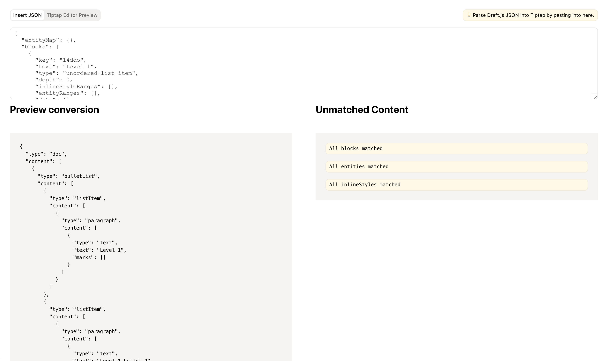

# Draft.js to Tiptap Visualizer application

This is a simple application that converts Draft.js content to Tiptap content.

## How to use

Paste your Draft.js content into the textarea. It will automatically try to convert it to Tiptap content based on the `./src/convertToJSON.ts` file. It will show the converted content and any blocks, entities or inline styles that were not converted.

Clicking the "Editor Preview" button will switch to a new tab with the Tiptap editor and the converted content. Allowing you to see if the conversion was successful.
